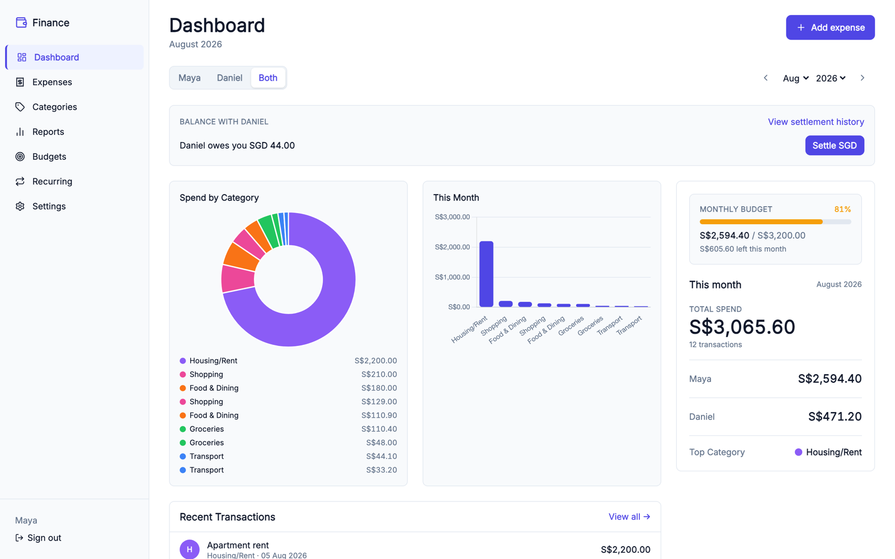
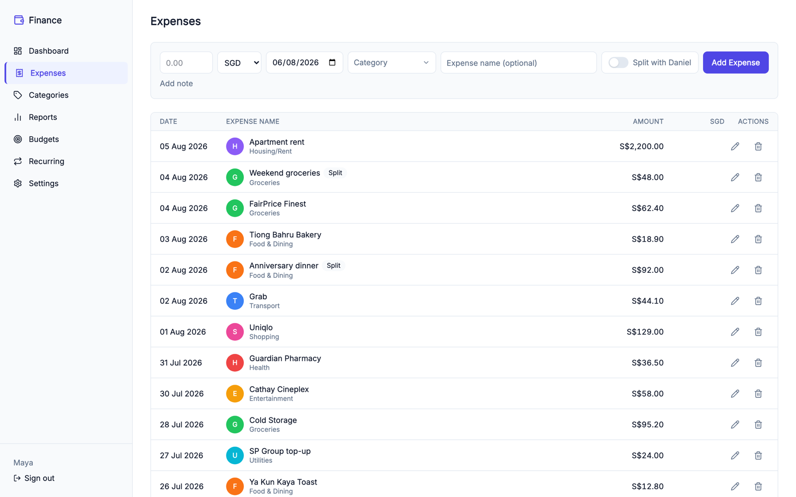
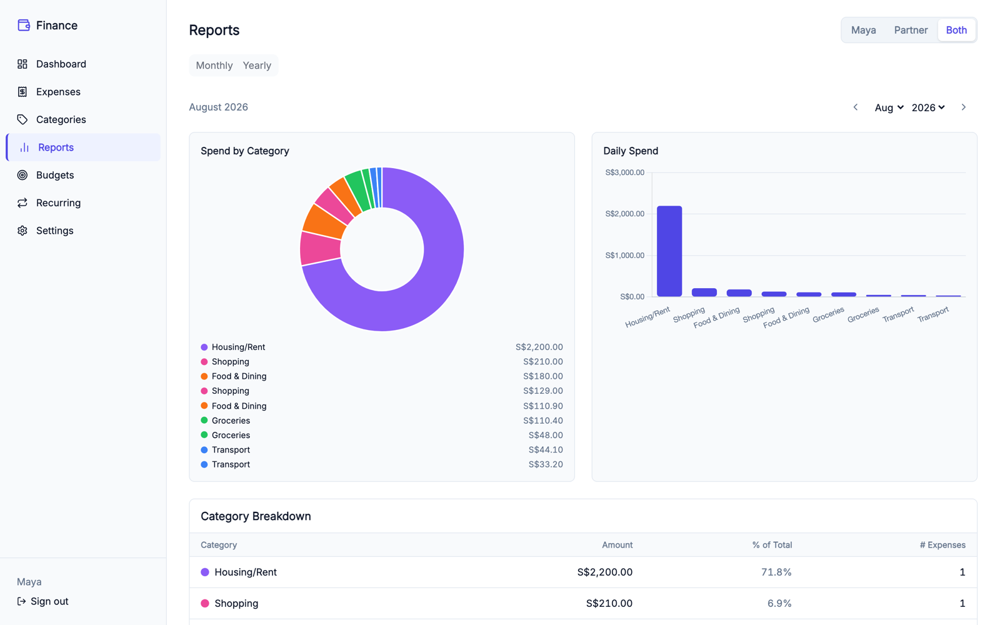
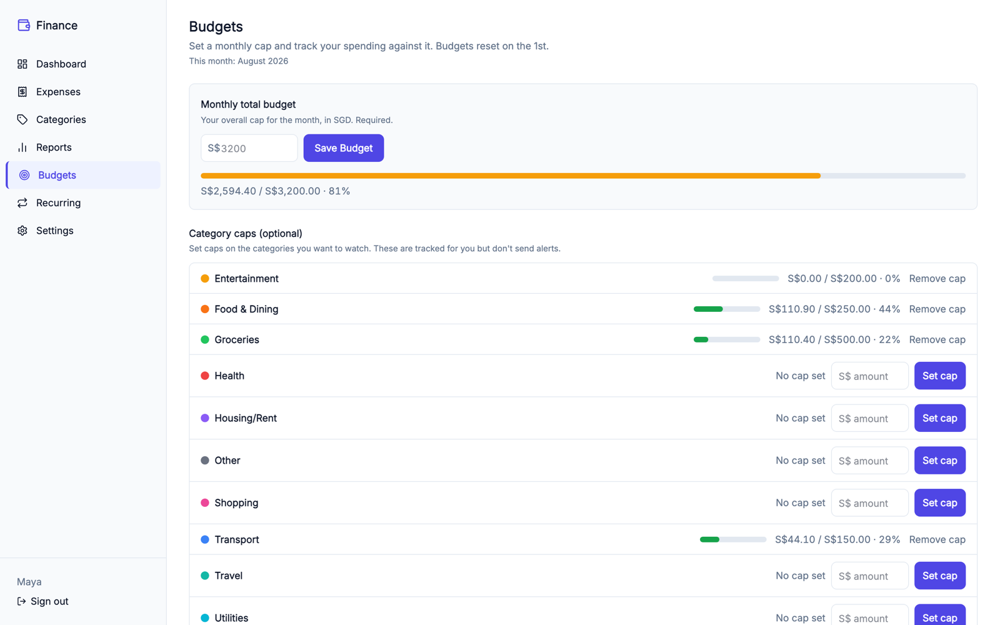
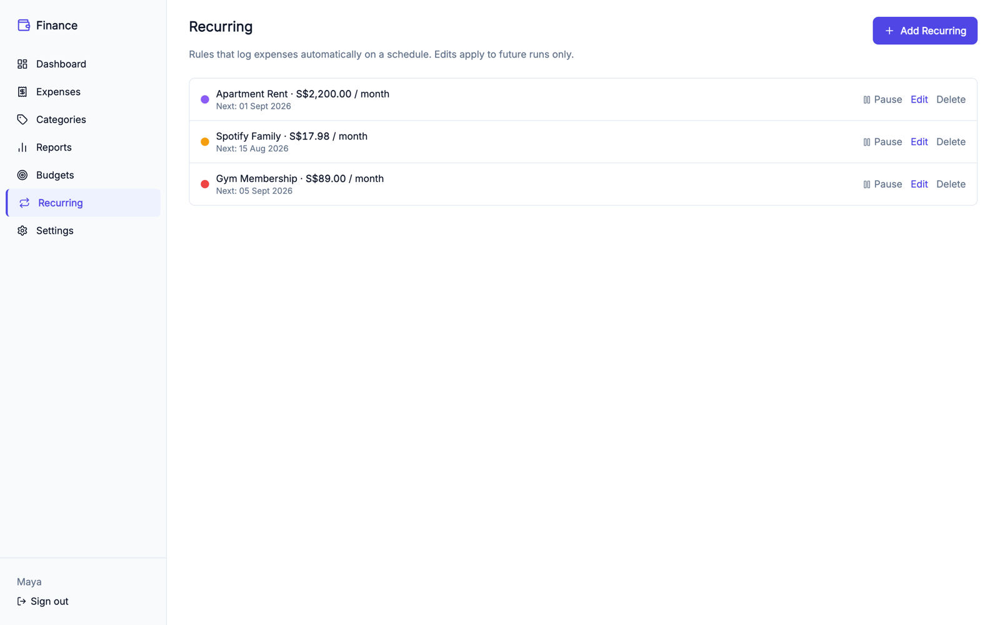
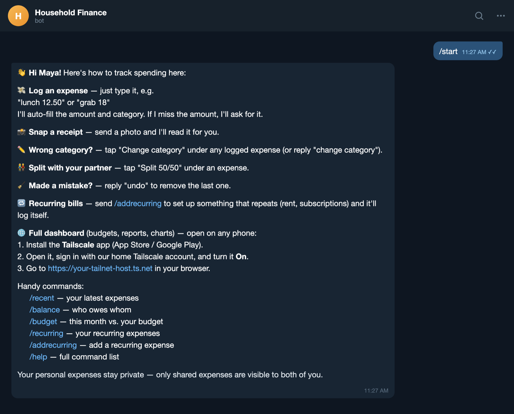

# Household Finance Tracker

**Tired of losing track of who paid for what?** Rent on one app, subscriptions
on another, and a running "you owe me" argument on top? We've got you covered.
One private ledger for two people sharing a household — track expenses in any
currency, set budgets, automate recurring bills, and see exactly who owes whom.
Log any expense straight from Telegram the second you spend it, so the ledger
never falls behind. Everything stays on your machine.

Under the hood, a FastAPI backend serves a built SvelteKit single-page app, with
per-user categories, a shared dashboard, and monthly/yearly reports. An optional
Telegram bot lets you capture expenses from your phone.

<p align="center">
  
</p>

> Screenshots use demo data with placeholder names (Maya & Daniel).

---

## Features

- **Shared ledger for two** — each person has their own login and categories;
  the dashboard can show your spending, your partner's, or both combined.
- **Multi-currency** — enter an expense in any currency; amounts are converted
  to a single base currency for reporting.
- **Budgets & alerts** — set monthly category budgets and get notified as you
  approach or exceed them.
- **Recurring expenses** — define rules (e.g. rent, subscriptions) that generate
  entries automatically.
- **Settle up** — track who owes whom on shared expenses.
- **Log from Telegram (optional)** — capture any expense straight from your
  phone the moment it happens: text it, snap a receipt, split it with your
  partner. No app to open, so you never forget to record a spend. Check your
  balance, budgets, and recent activity from the same chat. Reading the expense
  out of your message runs on a local model via Ollama — see
  [Requirements](#requirements).
- **Local & private** — SQLite on disk, LAN-only web server, on-device OCR and
  a locally-run model for the bot. No cloud AI service, no API key.

---

## Screenshots

| Expenses | Reports |
|:--:|:--:|
|  |  |
| Multi-currency ledger with split-expense badges | Monthly & yearly breakdowns per person or combined |
| **Budgets** | **Recurring** |
|  |  |
| Total cap plus per-category watch limits | Rules that log rent, subscriptions, etc. automatically |

**Telegram capture** — log expenses by texting them from your phone:

<p align="center">
  
</p>

---

## Requirements

- **macOS** — receipt-photo OCR uses Apple's Vision framework via
  [`ocrmac`](https://github.com/straussmaximilian/ocrmac), which pulls in
  PyObjC. It's declared without a platform marker, so `uv sync` will fail on
  Linux and Windows.
- **Python 3.14+** with [uv](https://github.com/astral-sh/uv)
  (`curl -LsSf https://astral.sh/uv/install.sh | sh`)
- **Node.js 18+** with npm

Additionally, **for the optional Telegram bot only**:

- **[Ollama](https://ollama.com)** plus the `hermes3:8b` model (~4.7 GB). The
  bot reads expenses out of your messages and receipt photos using a model
  running on your own machine — no cloud API, no API key, nothing leaves the
  host. Setup is in [Telegram bot](#telegram-bot-optional) below.

The web app itself needs neither Ollama nor a model.

---

## Quick start

Run these once, in order, from the project root.

```bash
# 1. Install backend dependencies
uv sync

# 2. Install and build the frontend (FastAPI serves the built output)
cd web && npm install && npm run build && cd ..

# 3. Create your session secret
cp .env.example .env
python -c "import secrets; print('SECRET_KEY=' + secrets.token_hex(32))" >> .env
# then open .env and remove the placeholder SECRET_KEY line if present

# 4. Create the database schema
uv run alembic upgrade head

# 5. Seed the two starter accounts and default categories
uv run python -m app.seed

# 6. Start the server (LAN-accessible)
uv run uvicorn app.main:app --host 0.0.0.0 --port 8000
```

Then open **http://localhost:8000** in a browser.

---

## First-time login — getting both people onto the dashboard

Step 5 above (`app.seed`) creates **two accounts**, each with default
categories. Both use the temporary password `changeme`:

| Username  | Password   | Display name |
|-----------|------------|--------------|
| `alice`   | `changeme` | Alice        |
| `partner` | `changeme` | Bob          |

These names are placeholders — rename the display names to suit your household
(see "Renaming the accounts" below).

**You (first person):**

1. Open http://localhost:8000 on your computer.
2. Log in as `alice` / `changeme`.
3. Go to **Settings** and change your password immediately.

**Your partner (second person):**

Your partner does **not** create their own account — the second account already
exists from seeding. They just log into it:

1. On their phone or laptop, open the app. If they're on the same Wi‑Fi, use the
   host machine's LAN address instead of `localhost`, e.g.
   **http://192.168.1.50:8000** (find the host's IP with `ipconfig getifaddr en0`
   on macOS, or `hostname -I` on Linux).
2. Log in as `partner` / `changeme`.
3. Go to **Settings** and change the password.

Once both people have logged in, the dashboard's **Mine / Partner / Both**
toggle shows each person's spending or the combined household view.

> The app is **LAN-only** — do not expose port 8000 to the public internet. It
> has no TLS and no rate limiting. Keep it on your home network.

### Renaming the accounts

The starter accounts are seeded with placeholder names. To use your own:

- **Display names** (what shows in the app): change them in **Settings**, or edit
  the `users_to_seed` list in `app/seed.py` **before** running step 5.
- **Usernames**: edit `app/seed.py` before seeding. If you've already seeded,
  the simplest reset is to delete `data/finance.db` and re-run steps 4–5 (this
  erases all data).

---

## Telegram bot (optional)

The bot lets each person capture expenses by texting them from their phone. It
writes into the same ledger as the web app.

### 1. Install Ollama and pull the model

Expense extraction runs locally through [Ollama](https://ollama.com). Install
it, then pull the model the bot expects:

```bash
brew install ollama          # or download from https://ollama.com
ollama serve                 # leave running (see Always-on deployment for launchd)
ollama pull hermes3:8b       # ~4.7 GB
```

How a message becomes an expense:

- **Text** (`$12 lunch`) → sent straight to `hermes3:8b`, which returns
  grammar-constrained JSON (amount, currency, merchant, date, category).
- **Receipt photo** → Apple Vision OCR extracts the text on-device, then that
  text goes to `hermes3:8b`. If OCR comes back blank, the bot reports the image
  as unreadable and never calls the model.

Dates are the one thing the model doesn't decide: it echoes relative words like
"yesterday" verbatim and the actual arithmetic happens in Python, since models
routinely get it wrong.

**Without Ollama running, the bot will fail on every message** — `EXTRACTOR`
defaults to `hermes`. To run the bot with no model at all, set `EXTRACTOR=stub`
in `.env` for a deterministic parser (first number in the message is the amount,
the rest is the merchant, date is always today, category is always "Other").

### 2. Configure environment variables

Add these to your `.env`:

| Variable | Where to get it |
|---|---|
| `TELEGRAM_BOT_TOKEN` | Create a bot with [@BotFather](https://t.me/BotFather) and copy the token |
| `TELEGRAM_ALLOWED_IDS` | Each person's numeric Telegram user ID, comma-separated. Send `/start` to [@userinfobot](https://t.me/userinfobot) to find yours. Example: `111111111,222222222` |

Only IDs in `TELEGRAM_ALLOWED_IDS` can use the bot; messages from anyone else
are silently ignored.

These control extraction and all have working defaults — set them only if you
want to change something:

| Variable | Default | What it does |
|---|---|---|
| `EXTRACTOR` | `hermes` | Extraction backend: `hermes`, `stub`, or `vlm` |
| `OLLAMA_BASE_URL` | `http://localhost:11434` | Where Ollama is listening |
| `OLLAMA_MODEL` | `hermes3:8b` | Model used by the `hermes` extractor |
| `VLM_MODEL` | `qwen3-vl:4b` | Only used when `EXTRACTOR=vlm` |

`EXTRACTOR=vlm` is a contingency path that skips OCR and sends the raw image to
a vision model. It's not the default and needs its own pull
(`ollama pull qwen3-vl:4b`); the OCR → Hermes route is the tested one.

### 3. Run the three processes

The web server, the bot, and the queue worker must run as **separate
processes** (the bot's long-poller cannot share the web server's event loop).
Each opens the same WAL-mode SQLite file. `ollama serve` must be running too —
the worker is what calls it.

```bash
# Terminal 1 — web server
uv run uvicorn app.main:app --host 0.0.0.0 --port 8000

# Terminal 2 — Telegram bot (long-polling)
uv run python -m bot.main

# Terminal 3 — queue worker (captures + budget/recurring notifications)
uv run python -m bot.worker
```

### 4. Each person links their account once

1. Log into the web app.
2. Go to **Settings → Generate link code**.
3. Send `/link <code>` to the bot within 15 minutes.

### Using the bot

- **Auto-log** — send `$12 lunch` and it's saved immediately.
- **Confirm flow** — send `lunch`; the bot asks for the amount, reply `8.50`.
- **Snap a receipt** — send a photo, and the bot reads it (see below).
- **Stuck?** — if the bot keeps asking about an entry you no longer want, send
  `/cancel` to discard it. Nothing is saved.
- **Commands** — `/recent`, `/undo`, `/cancel`, `/balance`, `/budget`,
  `/recurring`, `/help`.

### How receipt capture works

Photograph a receipt, send it to the bot, and it becomes a ledger entry. Nothing
is uploaded to a third-party service — OCR runs on-device through Apple Vision,
and the model runs on your own machine through Ollama.

<!-- TODO: add docs/screenshots/receipt.png — a Telegram thread showing a
     receipt photo, the "Reading receipt..." ack, and the resulting logged
     expense with its Split 50/50 / Change category buttons. -->

What happens after you hit send:

1. **Ack** — the bot replies `Reading receipt...` before it downloads anything,
   so you're not left wondering.
2. **Download** — it grabs the highest-resolution version of the photo Telegram
   holds and queues it for the worker. The bot process itself never blocks on
   inference.
3. **OCR** — the worker downscales the image to 1600px on its longest side and
   runs Apple's Vision text recognition (~200ms on Apple Silicon). Lines scoring
   below 0.1 confidence are dropped.
4. **Extraction** — the recognised text goes to `hermes3:8b` with receipt-specific
   instructions, and comes back as schema-constrained JSON.
5. **Validation** — every field the model returns is re-checked in Python before
   anything is written (see below).
6. **Save or ask** — if the amount clears 0.7 confidence, the expense is logged
   and you get a confirmation with **Split 50/50** and **Change category**
   buttons. Below 0.7, the bot asks you for the amount instead of guessing.

**Getting the total right.** Receipt OCR is a wall of numbers — line items,
quantities, subtotal, GST, service charge — and a generic prompt makes models
grab the first item or the pre-tax subtotal. So the receipt path adds explicit
guidance: take the *grand total* (the bottom-most `Total` / `Amount Due` /
`Total Payable`, or the amount charged to the card), never a line item, and
ignore loyalty "Balance" and "Points" lines. Currency is read off the receipt
itself, so `Rp` → IDR, `฿` → THB, `RM` → MYR, `S$` or a Singapore address → SGD.

**The model doesn't get the last word.** Its self-reported confidence is
overridden by rule-based checks:

| Field | Check | Result |
|---|---|---|
| Amount | Parseable to minor units? | Confidence floored at 0.9 — otherwise dropped to `null` at 0.0, never invented |
| Date | Parseable by `dateparser` (day-first)? | Confidence floored at 0.9 — otherwise today's date at 0.0 |
| Category | Actually in your category list? | Confidence floored at 0.7 — otherwise 0.0, which falls under the 0.5 gate and becomes "Other" |

Amounts are kept **exactly as printed** (`288.400`, `7,403.33`, `S$90.76`) and
normalised in Python rather than by the model, since asking a model to reformat
corrupts real decimals. Relative dates work the same way: the model echoes
"yesterday" verbatim and Python does the arithmetic.

**Failure modes.** A photo with no readable text short-circuits to an
"unreadable" result and the model is never called. If Ollama is down, the
capture errors and is recorded on the queue row — check the worker log.

---

## Backup & restore

Back up at any time against a live database (uses SQLite `VACUUM INTO`, safe for
WAL mode):

```bash
uv run python scripts/backup.py
```

This writes `backups/finance_<timestamp>.db` and verifies its integrity.
Schedule it via cron or launchd for regular automated backups.

**To restore:** stop the server, replace `data/finance.db` with a backup file,
then restart.

---

## Secret key

`SECRET_KEY` signs session cookies and lives in `.env`. Generate one with:

```bash
python -c "import secrets; print(secrets.token_hex(32))"
```

Do **not** regenerate it after users have logged in — it invalidates every
existing session.

---

## Always-on deployment

For unattended 24/7 operation on a dedicated always-on machine (e.g. a Mac
mini), five processes run as macOS user LaunchAgents instead of manual
terminal sessions: the web server, the Telegram bot, the queue worker, the
Ollama inference sidecar (`com.finance.ollama`, only needed if you run the
bot), and a short-lived scheduler that generates due recurring expenses and
runs the daily backup.

The launchd `.plist` templates in `deploy/launchd/` use placeholders
(`__FILL_ME__` for secrets, `/Users/YOUR_USERNAME/...` for paths) — fill them in
before installing. See **[DEPLOY.md](./DEPLOY.md)** for the full
install / relocate / restore runbook and the boot, restart, no-sleep, and
restore verification checklist.

---

## Development

Run the backend test suite:

```bash
SECRET_KEY=test uv run pytest tests/ -q
```

Run the frontend type checker:

```bash
cd web && npx svelte-check
```

---

## Contributing

Contributions are welcome — bug fixes, features, and docs alike.

1. **Set up** — follow [Quick start](#quick-start) to get the app running
   locally.
2. **Branch** — create a feature branch off `main`.
3. **Make your change** — keep it focused, and match the style of the
   surrounding code.
4. **Verify before you push** — both must pass:

   ```bash
   SECRET_KEY=test uv run pytest tests/ -q   # backend tests
   cd web && npx svelte-check                # frontend types
   ```

5. **Open a pull request** — describe *what* changed and *why*. Screenshots
   help for any UI change.

A couple of things to keep in mind:

- **Local-first by design.** The app is self-hosted and LAN-only, with no
  cloud services or telemetry. Please keep new features working offline and
  don't add external calls to the core app without discussion (the optional
  Telegram bot and FX-rate lookup are the deliberate exceptions).
- **Not sure where to start?** Open an issue to discuss the idea first — it
  saves everyone time.

---

## Reporting a bug

Open a [GitHub issue](https://github.com/fabianngpc/household-finance-tracker/issues/new/choose).
The bug template asks for your macOS version, `EXTRACTOR` setting, Ollama model,
and worker log — those four answers resolve most reports on the first reply.

Worth including for bot problems:

```bash
tail -n 50 ~/Library/Logs/finance/worker.err.log   # launchd
curl -s localhost:11434/api/tags                    # is Ollama up?
```

**Please redact before posting.** Logs can contain merchant names and amounts,
and never paste your `SECRET_KEY`, `TELEGRAM_BOT_TOKEN`, Telegram user IDs, or a
Tailscale/LAN hostname — none are needed to diagnose anything.

---

## License

Released under the [MIT License](./LICENSE).
